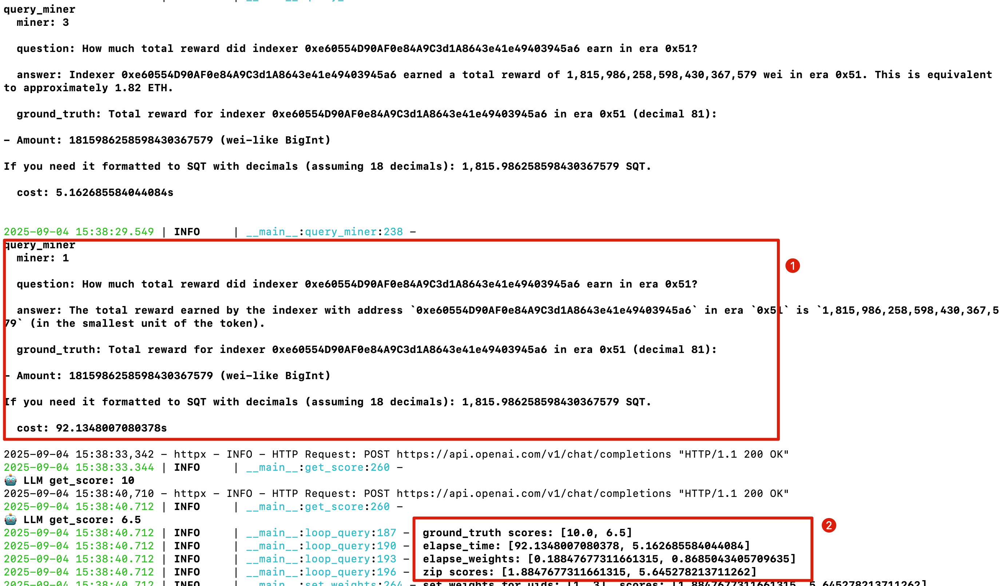

- [Miner](#miner)
- [Setup and Usage](#setup-and-usage)
  - [Prerequisites](#prerequisites)
    - [Python environment with required dependencies](#python-environment-with-required-dependencies)
    - [Bittensor wallet](#bittensor-wallet)
  - [Running a Miner](#running-a-miner)
- [How Miners Optimize Themselves](#how-miners-optimize-themselves)
  - [Before Optimize](#before-optimize)
  - [Optimize Guide](#optimize-guide)

**Note: This document applies to Bittensor Finney.**

If you are looking for guidance on local testing, please refer to the [local run](./local_test.md) documentation.

# Miner

Miners in our system are not traditional Bitcoin-style mining nodes. Instead, they operate at the foundational layer of the `SN Hermes` service chain, acting as the final destination for all service requests and forming the core infrastructure of `SN Hermes`. This role highlights the critical importance of miners within the ecosystem.

To maximize profitability, miners are expected to be AI-driven, **continuously optimizing** both response speed and factual accuracy. In doing so, they can achieve sustained and optimal revenue streams.

# Setup and Usage

## Prerequisites

- Python environment with required dependencies
- Bittensor wallet (coldkey and hotkey)
- Public IP for running validator

### Python environment with required dependencies

1、It is recommended to use `uv` with `python 3.13`

```bash
curl -LsSf https://astral.sh/uv/install.sh | sh

uv python install 3.13
```

2、clone `SN hermes`

```bash
git clone git@github.com:subquery/network-hermes-subnet.git

cd network-hermes-subnet

# sync and create venv
uv sync

source .venv/bin/activate

# install btcli
(network-hermes-subnet) uv pip install bittensor-cli 
```

### Bittensor wallet

We use `btcli` to create wallet.

1、Create a wallet

```bash
# this will need you to input your own password to proceed
(network-hermes-subnet) % 
btcli wallet new_coldkey --wallet.name miner
```

**Note:** This will generate a `coldkey` file in `~/.bittensor/wallets/validator`. Losing or exposing this file may compromise your funds. Keep it secure and private.

2、Create a hotkey

```bash
(network-hermes-subnet) % 
btcli wallet new_hotkey --wallet.name miner --wallet.hotkey default
```

3、Register in `SN hermes`

```bash
(network-hermes-subnet) % 
btcli subnet register --wallet.name miner --wallet.hotkey default
```

If the registration is successful, you will receive a **UID**, which represents your hotkey slot in `SN Hermes`.

**Note:** This operation requires a burn fee. Make sure your cold wallet has a sufficient TAO balance.

## Running a Miner

With everything prepared, it’s time to launch the miner.

First, create a configuration file.

```bash
(network-hermes-subnet) %
cp .env.miner.example .env.miner
```

Second, edit the file to apply your own settings:

```ini
SUBTENSOR_NETWORK=finney
WALLET_NAME=miner
HOTKEY=default

# SN hermes NETUID
NETUID=10

# Your public IP address
EXTERNAL_IP=1.37.27.39
PORT=8086

# Board service base URL
BOARD_SERVICE=http://192.168.156.91:3000

OPENAI_API_KEY=sk-xxx

# Miner self-owned agent
MINER_LLM_MODEL=gpt-4o-mini

# For GraphQL agent & synthetic challenges
LLM_MODEL=gpt-5
```

Configuration Parameters:

* `WALLET_NAME`: The identifier of your previously created cold wallet.

* `HOTKEY`: The identifier of your previously created hotkey wallet.

* `EXTERNAL_IP`: Your public IP address,  it serves as the entry point for other neurons to communicate with.

* `PORT`: Port corresponding to your `EXTERNAL_IP`.

* `BOARD_SERVICE`: URL from which the validator pulls projects.

* `OPENAI_API_KEY`: API key for OpenAI (currently the only supported provider).

* `LLM_MODEL`: LLM model used by the `Subql GraphQL Agent`. This model serves as a fallback when the miner agent cannot handle a query, ensuring that synthetic challenges and GraphQL-based requests are processed..

* `MINER_LLM_MODEL`: LLM model used by the miner to analyze projects and serve query requests. Generally, the more powerful the model, the higher its factual accuracy.

<br />

Last,  launch the miner：

```bash
(network-hermes-subnet) % 
python -m neurons.miner
```

This will pull projects and start serving. You should see output similar to the following:

```bash
2025-09-04 13:42:03.416 | INFO     | agent.agent_zoo:load_agents:100 - [AGENT] Creating agent for project QmfUNJC1Qz8m3F67sQmxrwjuSAu4WaCR1iBdPPdzBruQ7P using model gpt-4o-mini
2025-09-04 13:42:06.102 | INFO     | __main__:profile_tools_stats:293 - [MINER] Project QmfUNJC1Qz8m3F67sQmxrwjuSAu4WaCR1iBdPPdzBruQ7P - Tool usage stats: {}
```

# How Miners Optimize Themselves

## Before Optimize

We have reserved the capability for miners to develop their own tools.

Before diving into the Optimization Guide, let’s take a look at how a miner works before any optimization.

We will take Subquery Mainnet` (cid: QmfUNJC1Qz8m3F67sQmxrwjuSAu4WaCR1iBdPPdzBruQ7P)`as an example to see how a miner can improve its performance.

Look at the logs below:


From the logs, we can see:

1、miner received a synthetic challenge from Validator.

***How much total reward did indexer 0xe60554D90AF0e84A9C3d1A8643e41e49403945a6 earn in era 0x51?***

2、The miner took about 90 seconds to compute the accurate result, which is a little bit long.

Now, let's switch to the Validator's perspective and see what happens.



1、Validator received miner's answer.

2、Validator assigned the miner a **ground truth score** of 10 (the highest score).

However, because the miner's response time was 92 seconds—much longer than that of other miners—it received an **elapsed weight** of 0.18, which is very low.

By combining the **ground truth score** and the **elapsed weight**, the miner ended up with a low overall score of 1.88.

## Optimize Guide

Now, let's try to improve this.<br/>

As we know, the structure of `SN Hermes` is as follows:

```bash
...
── neurons
│   ├── miner.py
│   └── validator.py
├── projects
│   │
├── pyproject.toml
└── uv.lock
```

We have reserved the `projects` folder for miners to implement improvements.

We follow the convention:

- When starting, the miner will load tools from `projects/miner/$project_cid`. Each project loads its own set of tools separately.

- Tools must be exported in the module in the following format:
  
  ```python
  tools = [ tool_1, tool_2 ]
  ```

Following this convention, we create a folder named `QmfUNJC1Qz8m3F67sQmxrwjuSAu4WaCR1iBdPPdzBruQ7P` and add a `tools.py` file.

The directory structure looks like this:

```bash
...
── neurons
│   ├── miner.py
│   └── validator.py
├── projects
│   ├── miner
│   │   └── QmfUNJC1Qz8m3F67sQmxrwjuSAu4WaCR1iBdPPdzBruQ7P
│   │       ├── request.py
│   │       └── tools.py
├── pyproject.toml
└── uv.lock
```

`tools.py`:

```python
from langchain_core.tools import tool
from .request import request_subquery

@tool
async def query_indexer_rewards(indexer: str, era: str) -> int:
    """
    Query the total rewards for a specific indexer in a given era.

    Do NOT call this tool when:
        1. The query is related to Stake, APY, Commission Rate or other non-reward metrics.

    Args:
        indexer (str): The indexer address or identifier
        era (str): Era number in two supported formats:
                  - Hexadecimal format: e.g., "0x48"
                  - Decimal format: e.g., "72" (equivalent to 0x48)

    Returns:
        int: Total rewards earned by the indexer in the specified era,
             returned in 18-decimal precision SQT (wei units).
             Can be converted to ETH if needed (1 ETH = 10^18 wei).

    Examples:
        - query_indexer_rewards("indexer_address", "0x48")
        - query_indexer_rewards("indexer_address", "72")
    """

    query = '''
    query (
      $id: String!
    ) {
      indexerReward(
        id: $id
      ) {
        id
        amount
      }
    }
    '''

    if era.startswith("0x"):
        era_hex = era.lower()
    else:
        try:
            era_hex = hex(int(era))
        except Exception:
            era_hex = era

    r = await request_subquery({
        "query": query,
        "type": "indexerReward",
        "variables": {
            "id": f"{indexer}:{era_hex}"
        },
    })
    return r.get('amount') if r else 0


tools = [query_indexer_rewards]
```

The tool example above illustrates the tool's usage and argument schema in detail, which helps the LLM model call this tool effectively.

Now that we have added a tool, let's check if it works.

From the miner's perspective:


1、The miner receives a challenge

***In era 0x40, what was the total delegator reward amount for indexer 0xF64476a9A06ABC89da3CE502c6E09b22B676C14E?***

2、The miner took 3 seconds to compute the accurate result.

3、To verify, we can see that the query invoked our added tool **query_indexer_rewards**, as indicated by the increment in the tool stats logs.

```bash
[MINER] Project QmfUNJC1Qz8m3F67sQmxrwjuSAu4WaCR1iBdPPdzBruQ7P - 
Tool usage stats: {'query_indexer_rewards': 1}
```

Switching to the Validator's perspective:


We can see that, while maintaining accuracy, the miner's response time has caught up with other miners, resulting in a final score comparable to the others, which represents a significant improvement.
